# Entity-relationship diagram

Generated by hand from the EF Core model (`backend/src/TechBazar.Infrastructure/Persistence/Configurations`).
All business tables also carry `Id`, `CreatedAt`, `UpdatedAt`, `IsDeleted`, `DeletedAt` (omitted below for brevity).
`Users`/`Roles` are ASP.NET Core Identity tables (`Guid` keys).

```mermaid
erDiagram
    Category ||--o{ Category : "parent / children"
    Category ||--o{ Product : contains
    Brand ||--o{ Product : makes
    Product ||--o{ ProductImage : has
    Product ||--o{ ProductSpecification : has
    Product ||--o{ ProductKeyFeature : has
    Product ||--o{ Review : receives
    Users ||--o{ Review : writes
    Users ||--o| Cart : owns
    Cart ||--o{ CartItem : holds
    Product ||--o{ CartItem : "in"
    Users ||--o| Wishlist : owns
    Wishlist ||--o{ WishlistItem : holds
    Product ||--o{ WishlistItem : "in"
    Users ||--o{ Address : saves
    Users ||--o{ Order : places
    Order ||--|{ OrderItem : contains
    Product ||--o{ OrderItem : "sold as"
    Users ||--o{ RefreshToken : "has sessions"
    Users }o--o{ Roles : "UserRoles"

    Category {
        int Id PK
        string Name
        string Slug UK "unique where not deleted"
        int ParentId FK "nullable"
        int DisplayOrder
        bool IsActive
    }
    Brand {
        int Id PK
        string Name UK
        string Slug UK
        string LogoUrl
    }
    Product {
        int Id PK
        string Name
        string Slug UK "unique where not deleted"
        string Sku UK "unique where not deleted"
        decimal Price "18,2"
        decimal DiscountPrice "18,2 nullable, < Price"
        decimal EffectivePrice "18,2 indexed, maintained on save"
        int StockStatus "InStock|OutOfStock|PreOrder|UpComing"
        int StockQuantity
        int WarrantyMonths
        int SoldCount
        int ViewCount
        decimal RatingAverage "3,2"
        int ReviewCount
        int CategoryId FK
        int BrandId FK
    }
    ProductSpecification {
        int Id PK
        int ProductId FK
        string Group "e.g. Processor"
        string Key "e.g. Base Clock"
        string Value "e.g. 3.5 GHz"
        decimal NumericValue "nullable, parsed for TDP/Wattage/Capacity"
        bool IsFilterable "exposed as catalog facet"
    }
    ProductImage {
        int Id PK
        int ProductId FK
        string Url
        bool IsPrimary
    }
    ProductKeyFeature {
        int Id PK
        int ProductId FK
        string Text
    }
    Review {
        int Id PK
        int ProductId FK
        guid UserId FK
        int Rating "1..5"
        bool IsApproved
    }
    Cart {
        int Id PK
        guid UserId FK "unique"
    }
    CartItem {
        int Id PK
        int CartId FK
        int ProductId FK
        int Quantity
        decimal UnitPrice "price snapshot"
    }
    Wishlist {
        int Id PK
        guid UserId FK "unique"
    }
    WishlistItem {
        int Id PK
        int WishlistId FK
        int ProductId FK
    }
    Address {
        int Id PK
        guid UserId FK
        string Division
        string District
        string AddressLine
        bool IsDefault
    }
    Coupon {
        int Id PK
        string Code UK
        int DiscountType "Percentage|FixedAmount"
        decimal Value
        decimal MinOrderAmount
        decimal MaxDiscountAmount
        int UsageLimit
        datetime ExpiresAt
    }
    Order {
        int Id PK
        string OrderNumber UK
        guid UserId FK
        int Status "Pending..Returned"
        int PaymentMethod
        decimal Subtotal
        decimal DiscountTotal
        decimal ShippingFee
        decimal GrandTotal
        string CouponCode "snapshot, no FK"
    }
    OrderItem {
        int Id PK
        int OrderId FK
        int ProductId FK
        string ProductName "snapshot"
        string Sku "snapshot"
        decimal UnitPrice
        int Quantity
        decimal LineTotal
    }
    AccountToken {
        int Id PK
        guid UserId FK
        int Purpose "EmailVerification|PasswordReset"
        string TokenHash UK "SHA-256, never the raw token"
        string Email "normalised, bound at issue"
        datetime ExpiresAt
        datetime UsedAt "spent or superseded"
    }
    OrderStatusHistory {
        int Id PK
        int OrderId FK
        int Status
        string Note
        guid ChangedByUserId
        datetime CreatedAt
    }
    Payment {
        int Id PK
        int OrderId FK
        string TransactionId UK "<orderNo>-<attempt>"
        string Gateway "cod|sslcommerz"
        int Method
        decimal Amount
        int Status "Pending|Paid|Failed|Cancelled|Refunded"
        string GatewayReference
        int Version "optimistic concurrency"
        datetime PaidAt
    }
    PcBuild {
        int Id PK
        string Code UK "share code"
        guid UserId "nullable"
        string Name
    }
    PcBuildItem {
        int Id PK
        int PcBuildId FK
        int ProductId FK
        int Slot
        int Quantity
    }
    RefreshToken {
        int Id PK
        guid UserId FK
        string TokenHash UK "SHA-256, never the raw token"
        datetime ExpiresAt
        datetime RevokedAt
        string ReplacedByTokenHash
    }
```

Relationships added in Phase 3: `Order 1—* OrderStatusHistory`, `Order 1—* Payment`, `PcBuild 1—* PcBuildItem *—1 Product`.
`Order` also stores `ShippingMethod`, `ContactEmail` and the shipping-address snapshot; `OrderItem.StockDecremented` makes restocking exact.
`Product` and `Coupon` have an int `Version` for optimistic concurrency.

## Notes
- **Soft delete**: a global query filter hides `IsDeleted` rows; `DbContext.SaveChangesAsync` converts deletes to updates.
  Unique indexes on `Slug` / `Sku` / `Code` / `OrderNumber` are filtered (`[IsDeleted] = 0`) so values can be reused.
- **Orders** snapshot name, SKU, price and the shipping address so history survives catalog/address edits. `Coupon` is
  referenced by code only (the coupon may later be edited or deleted).
- **PC Builder keys** (stored as `ProductSpecification` rows): `Socket`, `RAM Type`, `Form Factor`, `TDP` (CPU/GPU, W),
  `Wattage` (PSU, W), `Recommended PSU` (GPU, W), `Max GPU Length` (case, mm). `NumericValue` holds the parsed number.
